# kuberag

[](https://github.com/furkandogmus/kuberag/actions/workflows/ci.yaml)

Kubernetes-native operator for declarative RAG knowledge bases.

`kuberag` is a **RAG lifecycle operator** (managing synchronization, chunking, embedding, vector store ingestion, evaluation, auto-tuning, and serving) rather than an application-level framework (like LangChain or LlamaIndex). It automates and manages the infrastructure and operations layer of RAG.

You describe the *desired knowledge state* — sources, chunking, embedding model,
vector store, freshness, retrieval-quality target — and the operator continuously
reconciles reality toward it: syncing sources, chunking, embedding, writing to the
vector DB, re-indexing on drift, evaluating retrieval quality and **auto-tuning
chunking** to hit a recall target, and serving low-latency retrieval (optionally
with LLM answer generation — full RAG).

```yaml
apiVersion: rag.furkan.dev/v1alpha1
kind: KnowledgeBase
metadata:
  name: company-docs
spec:
  sources:
    - name: docs
      type: github
      github: { repo: qdrant/landing_page, ref: master, includeGlobs: ["**/*.md"] }
  chunking: { strategy: semantic, maxTokens: 800, overlap: 80 }
  embedding: { model: bge-small, provider: local }   # change model -> full re-embed
  vectorStore: { type: qdrant, endpoint: http://qdrant:6333, collection: company-docs }
  ingestion: { mode: incremental }                   # skip unchanged sources
  freshness: { schedule: "0 */6 * * *" }
  retrievalQuality:
    enabled: true
    evalSchedule: "0 * * * *"
    datasetRef: { name: company-docs-eval }
    minimumRecallPercent: 80
    autoTune: { enabled: true, maxAttempts: 3 }       # below target -> tune & re-index
```

## Status

`v1alpha1`, early but functional. Validated **end-to-end on a live cluster** (k3d):
GitHub / S3 (MinIO) / web sources → Qdrant **and** pgvector; Gemini and Ollama
embeddings; Ollama answer generation; incremental ingest; the eval + auto-tune
loop; finalizer cleanup; in-cluster deployment; blobless+sparse clone.

## Documentation

- [Architecture](docs/ARCHITECTURE.md) — control/data planes, reconcile state machine, ingest/eval/auto-tune, hashing.
- [API reference](docs/API.md) — every CRD field (`KnowledgeBase`, `Retriever`, `VectorIndex`).
- [Providers & backends](docs/PROVIDERS.md) — sources, stores, embeddings, generation (+ fully-local Ollama).
- [Observability](docs/OBSERVABILITY.md) — status/conditions, events, Prometheus metrics, Grafana dashboard.
- [Roadmap](docs/ROADMAP.md) · [Contributing](CONTRIBUTING.md) · [Security](SECURITY.md)

## Custom Resources

| Kind | Short | Purpose |
|------|-------|---------|
| `KnowledgeBase` | `kb` | The control surface: sources → chunk → embed → store, freshness, quality, auto-tune. |
| `Retriever` | `rtr` | A serving endpoint (Deployment + Service) over a KnowledgeBase: vector search, optional reranking, and optional LLM answer generation. |
| `VectorIndex` | `vi` | Auto-created per KnowledgeBase; tracks collection health, point count and dimension. |

## Supported backends

- **Sources:** `github` (public/private via token, blobless+sparse clone), `s3` (incl. MinIO and other S3-compatible stores), `web` (depth-bounded crawl).
- **Vector stores:** `qdrant`, `pgvector`, `milvus`.
- **Embeddings:** `local` (fastembed: `bge-small`/`bge-large`) or any OpenAI-compatible API via `openai` / `gemini` / `openai-compatible` (OpenAI, Gemini, **Ollama**, vLLM, LM Studio, TEI, …). Dimension is taken from a built-in table or auto-detected.
- **Generation** (optional, on `Retriever`): OpenAI-compatible chat — `openai` / `openrouter` / `groq` / `gemini` / `openai-compatible` (incl. **Ollama**). `/query` then returns `{answer, sources}`.

## Architecture



Two planes, intentionally separated:

| Plane | What | Tech |
|-------|------|------|
| **Control** | Decides *when* to ingest/evaluate/tune, manages Job + Deployment lifecycle, reports status, emits events & metrics | Go + controller-runtime |
| **Data** | Does the work: clone/list/crawl → chunk → embed → upsert; evaluate; serve | Python (`worker/`) |


The KnowledgeBase reconciler:

1. Computes a `specHash` over re-ingest-relevant fields (sources, effective chunking, model, store).
2. Decides work: **ingest** (first run, spec drift, model change, or freshness cron) takes priority, then **evaluate** (eval cron).
3. Creates a single in-flight **Job** (tracked in `status.activeJob`), injecting secrets as env and passing the spec as JSON.
4. On completion reads the worker's **result ConfigMap** and writes `status` (phase, conditions, `indexedChunks`, per-source revisions, evaluation).
5. **Incremental ingest:** the worker probes each source's revision (`git ls-remote` SHA, S3 ETags, crawl hash) and skips unchanged sources; a spec change forces a full re-process.
6. **Auto-tune:** if measured recall < `minimumRecallPercent` and auto-tune is enabled, it adjusts effective chunking (grow overlap, then shrink chunk size), clears the spec hash to force a re-index, and retries up to `maxAttempts`; if still short it goes `Degraded`.
7. **Deletion:** a finalizer runs a `cleanup` Job that drops the remote collection before the object is removed.

## Project layout

```
api/v1alpha1/          CRD Go types (+ generated DeepCopy)
internal/controller/   reconcilers (knowledgebase, retriever, vectorindex),
                       jobs / scheduling / metrics, unit + envtest integration tests
cmd/main.go            manager entrypoint (3 controllers, leader election)
worker/rag_worker/     Python data plane: sources, stores, chunking, embeddings,
                       ingest, evaluate, cleanup
worker/retriever/      FastAPI retrieval + generation server
worker/tests/          Python unit tests
config/crd|rbac|manager   generated CRDs, RBAC, operator Deployment
config/samples/        runnable examples (Qdrant, pgvector, MinIO, Ollama, Gemini, …)
.github/workflows/     CI (Go build/vet/fmt/unit/integration + Python tests)
```

## Quick start (local)

```bash
make test               # Go unit tests
make test-integration   # envtest integration tests (downloads kube-apiserver/etcd)
make test-py            # Python worker tests

make install            # install CRDs
make run                # run the operator against your current kubeconfig
make sample             # Qdrant + worker RBAC + eval dataset + KnowledgeBase + Retriever

kubectl get kb,vi,rtr
```

In-cluster (prebuilt images are published to GHCR by CI, so you can skip the build):

```bash
# ghcr.io/furkandogmus/{kuberag,kuberag-worker,kuberag-retriever}:latest
make deploy             # CRDs + RBAC + manager (pulls the published images)
make worker-rbac        # worker ServiceAccount/RBAC (per KB namespace)

# or build your own first:
make docker-build-all   # operator + worker + retriever images
```

Or run the whole thing on a throwaway k3d cluster with one command:

```bash
make demo               # k3d up -> deploy -> ingest a repo -> query
```

### Fully local RAG with Ollama (no API keys)

```bash
ollama pull nomic-embed-text && ollama pull qwen2.5:3b
# expose Ollama to the cluster: OLLAMA_HOST=0.0.0.0, then point baseURL at the host
kubectl apply -f config/samples/ollama.yaml
kubectl port-forward svc/ollama-docs-retriever 8000:8000
curl -s localhost:8000/query -d '{"query":"what is this about?"}' | jq
# -> {"answer": "...", "results": [{"docPath": "...", "score": 0.7, ...}]}
```

See `config/samples/providers.yaml` for a Gemini-embeddings + hosted-LLM example.

## Status & observability

```bash
$ kubectl get kb
NAME           PHASE   MODEL              CHUNKS   RECALL   LASTINDEXED   AGE
company-docs   Ready   bge-small          742      86       2m            5m

$ kubectl get vi
NAME                 HEALTH    POINTS   DIM   AGE
company-docs-index   Healthy   742      384   5m
```

- `status.conditions`: `Ready`, `Ingesting`, `Evaluated` (KB); `Ready` (VectorIndex); `Available` (Retriever).
- **Events** on every transition (`IngestionStarted/Complete/Failed`, `Evaluating`, `RecallMet`, `AutoTuning`, `RecallBelowTarget`, `Cleanup`).
- **Prometheus metrics** on `:8080`: `rag_knowledgebase_ingestions_total`, `rag_knowledgebase_indexed_chunks`, `rag_knowledgebase_recall_percent`, `rag_knowledgebase_autotune_attempts`.

## Design notes / limitations

- One in-flight Job per KnowledgeBase (ingest *or* eval) keeps reconciliation deterministic.
- Auto-tune adjusts chunking only; it does not change the embedding model.
- VectorIndex health probing is implemented for Qdrant (HTTP); other stores report `Unknown` and rely on ingestion success.
- Recall is computed as recall@TopK over a user-provided query dataset (expected source paths).
- The API group is `rag.furkan.dev` (independent of the repository name).

## License

MIT — see [LICENSE](LICENSE).
